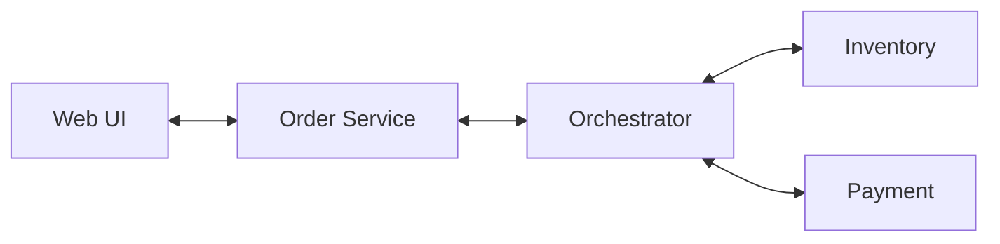
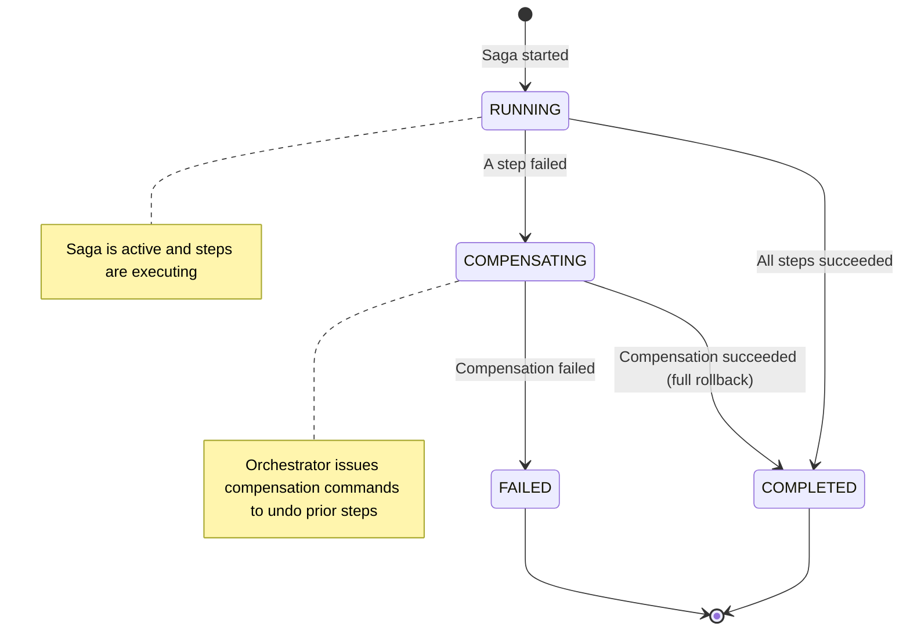
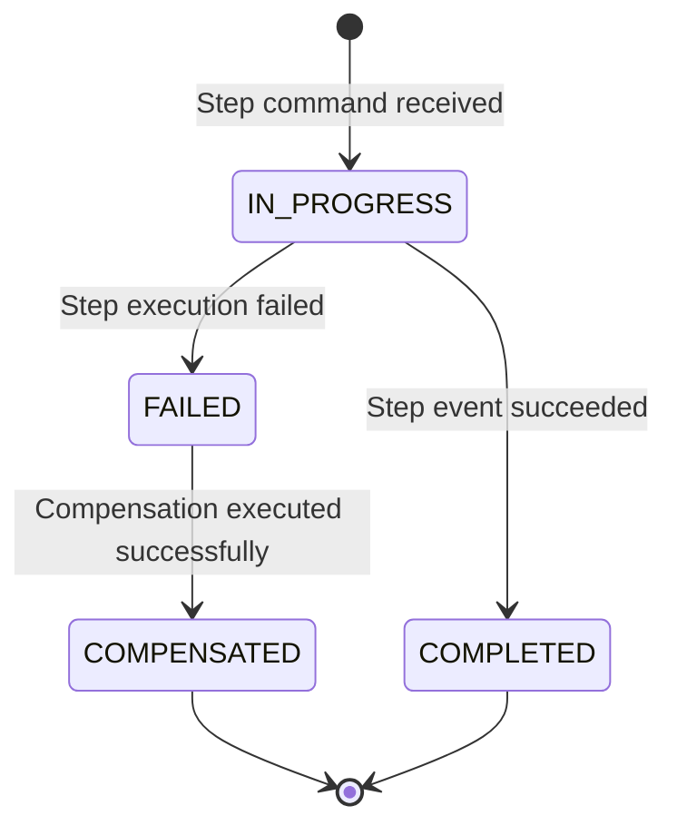
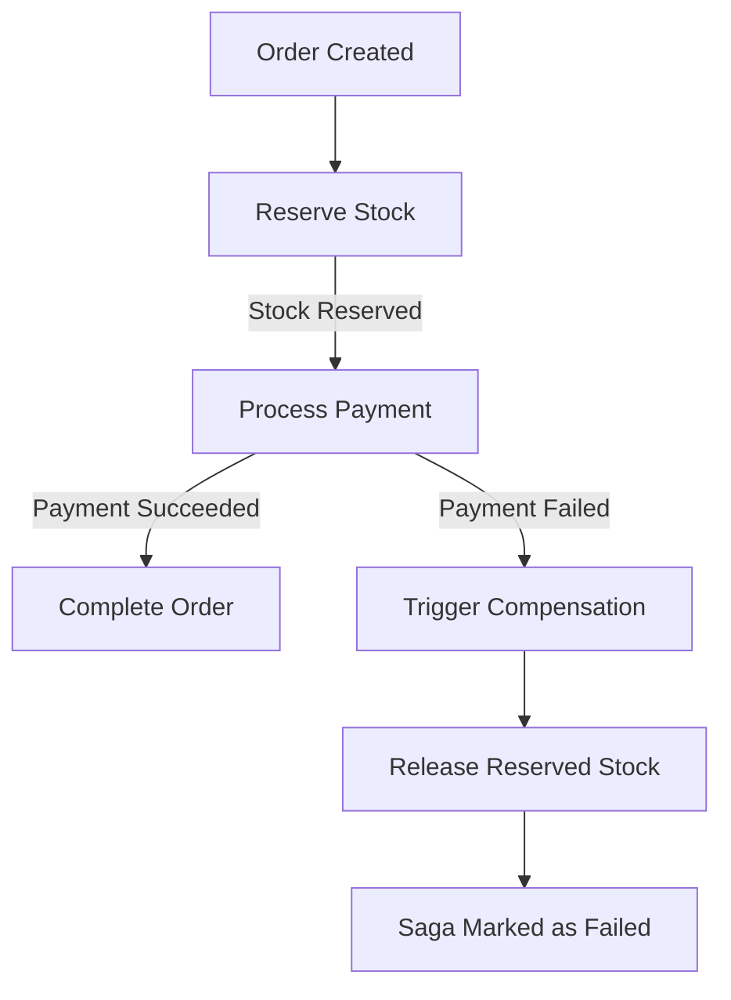
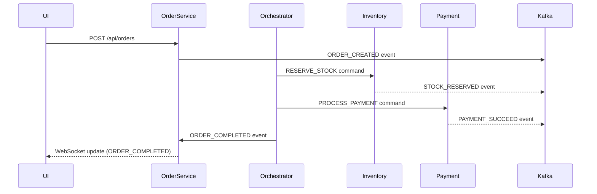

# 🧩 Dynamic SAGA Orchestration Microservices (Order-Inventory-Payment Demo)

This project demonstrates a **dynamic SAGA orchestration platform** built with **Spring Boot 3.5.6**, **Kafka**, and **Redis**.  
It allows SAGA workflows to be **defined and executed dynamically** across independent microservices.

To showcase the orchestration system in action, an example domain — **Order → Inventory → Payment** — is implemented.

---

## 🚀 Overview

This system is composed of multiple Spring Boot microservices that communicate asynchronously through Kafka topics.  
The **Orchestrator Service** manages workflow states, triggers compensations when necessary, and keeps the overall process consistent.

> The core goal of this project is to prove the ability to **build dynamic, event-driven SAGA orchestration infrastructure** suitable for distributed microservice environments.

---

## 🧱 Microservices

| Service                  | Description                                                                                                                                    |
|--------------------------|------------------------------------------------------------------------------------------------------------------------------------------------|
| **order-service**        | Exposes REST API (`/api/orders`) and WebSocket endpoint. Publishes `ORDER_CREATED` events.                                                     |
| **inventory-service**    | Handles stock reservation using Redis for fast access. Publishes `STOCK_RESERVED` or `STOCK_RELEASED` events.                                  |
| **payment-service**      | Simulates payment processing; publishes `PAYMENT_SUCCEED` or `PAYMENT_REFUNDED` events.                                                        |
| **orchestrator-service** | Central coordinator that dynamically executes SAGA definitions, publishes commands, listens for results, and triggers compensations if needed. |
| **redis (infra)**        | Used both for inventory caching and orchestration workflow timeouts.                                                                           |
| **kafka (infra)**        | Message broker enabling reliable asynchronous communication.                                                                                   |

---

## 🧭 Architecture



* All communication between services occurs through Kafka topics.
* Orchestrator service drives the process using a dynamic SAGA definition (workflow steps and compensations).
* Redis is used both as:
  * A fast stock store (for reservation logic).
  * A timer mechanism (for SAGA timeouts and expirations).

## ⚙️ Technologies
* Java 17
* Spring Boot 3.5.6
* Spring Kafka
* Spring Data Redis
* Docker & Docker Compose
* WebSocket (Spring Messaging)
* Maven build tool

## 🧪 Saga Flow Example
### ✅ Successful Flow
1.Client sends `POST /api/orders` or submits from UI.  
2.`order-service` publishes `ORDER_CREATED`.  
3.`orchestrator-service` starts the workflow and issues `RESERVE_STOCK`.  
4.`inventory-service` checks stock → publishes `STOCK_RESERVED`.  
5.`orchestrator-service` publishes `PROCESS_PAYMENT`.  
6.`payment-service` simulates success → publishes `PAYMENT_SUCCEED`.  
7.`orchestrator-service` finalizes the SAGA → publishes `ORDER_COMPLETED`.  
8.WebSocket in UI receives the final status.

### ❌ Failure & Compensation Flow
**If any step fails (e.g., payment fails):**

1.`orchestrator-service` triggers compensation logic.  
2.It dynamically issues compensation commands (e.g., release reserved stock).  
3.SAGA status transitions through `COMPENSATING → COMPENSATED → FAILED`.  
4.All relevant status updates are pushed to the UI via WebSocket.

## 🧰 Run the Project
1. **Clone the repository**
   ```bash
   git clone https://github.com/ali449/saga-orchestrator.git
   cd stock
   ```
2. **Start infrastructure**
   ```bash
   docker compose build
   docker compose up -d
   ```
   This brings up:
   * Kafka broker
   * Redis instance
   * All microservices (order, inventory, payment, orchestrator)

3. **Access the simple UI**
   * Create stock with APIs in `./inventory/src/test/test_api.http`
     ```http
     POST localhost:8082/api/stocks
     {
     "name": "apple-123",
     "quantity": 20
     }
     ```
   * Open http://localhost:8081
   * Submit a new order and watch its status live via WebSocket.

## 🧪 Testing the Orchestrator
This project includes **some tests for the SAGA orchestration logic**, demonstrating how the orchestrator handles:

- Normal workflow execution (all steps succeed → SAGA completes).
- Compensation flow (any step fails → orchestrator triggers compensating commands).

The tests focus on **behavioral correctness** rather than full coverage, showing that the system reacts as expected to events and commands.

```java
@SpringBootTest
class SagaTests {
}
```

## 📜 Example Kafka Topics

| Category    | Example Topics                                             |
|-------------|------------------------------------------------------------|
| Events      | `order-events`, `inventory-events`, `payment-events`       |
| Commands    | `order-commands`, `inventory-commands`, `payment-commands` |
| SAGA events | `orchestrator-events`                                      |
> Note: Instead of creating all these topics, we could just have one for events and another for commands. 
> Right now, separate topics have been set up here to keep the processes organized.

## 🕒 Timeout Handling
The orchestration system uses Redis to manage SAGA workflow timeouts.
If a saga step exceeds its configured time limit, the orchestrator automatically triggers compensation flow and marks the saga as failed.

## 🧩 Dynamic SAGA Definition
Unlike a hard-coded sequence, workflows are loaded dynamically:
* Each saga defines its steps, compensation pairs, and transitions.
* The orchestrator interprets and executes them at runtime.
* This makes the system reusable as SAGA infrastructure for multiple business domains.

## 🧩 Workflow Visualization
Below diagrams illustrate the internal state machines and message flow used in the dynamic SAGA orchestration system.
### SAGA Lifecycle


### SAGA Step Lifecycle

* It maps perfectly to your StepState enum.

### Order → Inventory → Payment Flow
**business flow diagram**


### 🧮 4. Full System Interaction
**microservices’ event choreography**


## 🚧 Future Improvements
* Add real persistence for Order and Payment services.
* Provide a REST API for defining SAGA workflows dynamically.
* Integrate distributed tracing (OpenTelemetry).
* Add monitoring dashboard for saga execution.

